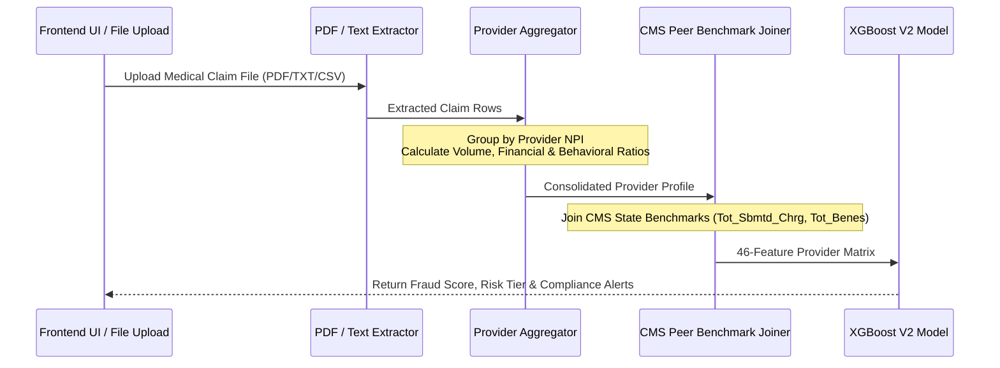

# Technical Architecture & System Documentation: Version 2 Model

This document serves as the comprehensive technical reference for the **Version 2 Provider-Level Machine Learning & Compliance Engine**. It details the system architecture, dataset engineering, 46-feature matrix, frontend claim extraction pipeline, model performance, and hybrid combination with Isolation Forest.

---

## 1. System Architecture & Two-Layer Workflow

The Version 2 system operates on a **Two-Layer Payment Integrity Architecture**, separating deterministic legal compliance checking from supervised behavioral machine learning.

```mermaid
flowchart TD
    A[Incoming Claim Document / PDF / JSON] --> B[Claim Parser & Field Extractor]
    B --> C{Layer 1: Direct LEIE Compliance Check}
    
    C -->|Active LEIE NPI / Name Match| D[CRITICAL COMPLIANCE ALERT<br/>Score: 1.00 | Status: DIRECT_LEIE_EXCLUSION_MATCH]
    
    C -->|No Direct Exclusion| E[Provider-Level Aggregation Engine]
    E --> F[CMS State Peer Benchmark Join]
    F --> G[Layer 2: XGBoost Behavioral ML Engine<br/>46 Pure Behavioral Features]
    
    G --> H[Risk Tier Assignment<br/>Low / Medium / High / Critical]
    
    D --> I[Final Hybrid Payment Integrity Queue]
    H --> I
```

### Layer 1: Deterministic LEIE Compliance Gatekeeper
- **Function**: Direct inspection of incoming 10-digit NPIs or Provider Names against active exclusions in `LEIE_MASTER.csv`.
- **Active Filter**: Identifies records where `Record_Type == "EXCL"` and `REINDATE` is empty or `"00000000"`.
- **Output**: Immediate **`1.00 Critical Risk`** override (`DIRECT_LEIE_EXCLUSION_MATCH`).

### Layer 2: Machine Learning Behavioral Risk Engine
- **Function**: Evaluates provider billing patterns across **46 pure behavioral features** (ghost billing, upcoding ratios, physician stacking, procedure density, and CMS state peer benchmarks).
- **Output**: Continuous fraud probability score (`0.00` to `1.00`) mapped to calibrated Risk Tiers.

---

## 2. Frontend Input Schema & Claim Aggregation Flow

### 2.1 Input Claim Schema (Frontend PDF / TXT / CSV / JSON)
Claims uploaded via the frontend UI or API endpoints (`/api/predict_file`, `/api/predict_provider`) are parsed into standard claim objects containing the following schema:

```json
{
  "ClaimID": "CLM_2026_001",
  "BeneID": "BENE_991028",
  "Provider": "1033472386",
  "ClaimStartDt": "2024-01-10",
  "ClaimEndDt": "2024-01-15",
  "InscClaimAmtReimbursed": 45000.0,
  "DeductibleAmtPaid": 500.0,
  "AttendingPhysician": "PHY_101",
  "OperatingPhysician": "PHY_102",
  "OtherPhysician": "PHY_103",
  "State": "FL",
  "ClaimType": "Outpatient",
  "ClmDiagnosisCode_1": "4019",
  "ClmProcedureCode_1": "99214"
}
```

### 2.2 Provider-Level Aggregation Logic
The backend aggregation engine (`aggregate_to_provider` in `train_xgboost_fraud_v2.py`) transforms claim-level rows into a consolidated provider profile:



---

## 3. Master Datasets & Data Engineering Pipeline

The Version 2 training pipeline integrates three primary master datasets:

| Dataset Name | Source / Path | Purpose in V2 Architecture |
| :--- | :--- | :--- |
| **Kaggle Provider Fraud Dataset** | `KAGGLE_MASTER_TRAIN.csv` | Training aggregated provider behavioral profiles and target fraud labels. |
| **CMS Provider Master** | `CMS_PROVIDER_MASTER.csv` | State-level peer group statistics (`Tot_Sbmtd_Chrg`, `Tot_Benes`, risk scores). |
| **HHS OIG LEIE Exclusions** | `LEIE_MASTER.csv` | Layer 1 direct compliance check database (active exclusion windows). |

---

## 4. Complete 46-Feature Behavioral Architecture

The XGBoost V2 model is trained on **46 pure behavioral features** categorized into 5 core risk factors:

### Factor 1: Ghost Billing & Identity Exploitation
1. `ghost_billing_rate`: Fraction of claims submitted after beneficiary date of death.
2. `any_deceased_bene`: Flag indicating if provider ever billed for a deceased patient.

### Factor 2: Financial Volume & Reimbursement Spikes
3. `total_claims`: Total claim volume billed by provider.
4. `unique_beneficiaries`: Count of unique patients treated.
5. `claims_per_beneficiary`: Claim frequency per patient (detects patient churning).
6. `total_reimbursement`: Cumulative Medicare reimbursement claimed.
7. `avg_claim_reimbursed`: Average reimbursement per claim.
8. `max_claim_reimbursed`: Maximum single claim payout.
9. `std_claim_reimbursed`: Standard deviation / volatility of claim payouts.
10. `reimbursement_per_claim`: Average reimbursement per claim volume.
11. `avg_deductible_paid`: Average patient deductible paid.
12. `avg_ip_annual_reimb`: Average annual inpatient reimbursement per patient.
13. `avg_op_annual_reimb`: Average annual outpatient reimbursement per patient.
14. `avg_total_annual_reimb`: Combined average annual reimbursement.
15. `ip_vs_op_ratio`: Inpatient vs Outpatient annual reimbursement ratio.

### Factor 3: Physician Stacking & Over-Billing (Collusion Signals)
16. `physician_stacking_rate`: Fraction of claims listing 3+ physicians (Attending, Operating, Other).
17. `avg_physician_count`: Average number of physicians assigned per claim.
18. `avg_claim_duration`: Average claim length in days.
19. `avg_los`: Average inpatient length of stay.
20. `avg_bene_age`: Average age of treated beneficiaries.
21. `ip_claim_ratio`: Fraction of claims that are Inpatient.

### Factor 4: Clinical Upcoding & CMS State Peer Benchmarks
22. `avg_diagnosis_density`: Average diagnosis codes attached per claim.
23. `avg_procedure_density`: Average procedure codes attached per claim.
24. `charge_vs_peer_ratio`: Provider total reimbursement vs. **CMS State Peer Median Charge**.
25. `benes_vs_peer_ratio`: Provider unique patients vs. **CMS State Peer Median Patient Volume**.
26. `avg_risk_score_vs_peer`: Provider beneficiary age/risk complexity vs. **CMS State Peer Average**.
27. `peer_median_Tot_Sbmtd_Chrg`: State peer median submitted charges.
28. `peer_median_Tot_Mdcr_Pymt_Amt`: State peer median Medicare payments.
29. `peer_median_Tot_Benes`: State peer median patient count.
30. `peer_median_Bene_Avg_Risk_Scre`: State peer median patient risk score.
31. `peer_median_Bene_CC_PH_Diabetes_V2_Pct`: State peer median diabetes rate.
32. `peer_median_Bene_CC_PH_HF_NonIHD_V2_Pct`: State peer median heart failure rate.
33. `peer_median_Bene_CC_PH_CKD_V2_Pct`: State peer median kidney disease rate.

### Factor 5: Chronic Condition Burden & Specific Disease Rates
34. `avg_chronic_burden`: Average number of chronic conditions per patient (0–11 scale).
35. `renal_disease_rate`: Percentage of patients with End-Stage Renal Disease.
36. `cc_alzheimer_rate`: Alzheimer's / Dementia patient rate.
37. `cc_heartfailure_rate`: Heart Failure patient rate.
38. `cc_kidneydisease_rate`: Chronic Kidney Disease patient rate.
39. `cc_cancer_rate`: Cancer patient rate.
40. `cc_obstrpulmonary_rate`: COPD / Pulmonary Disease patient rate.
41. `cc_depression_rate`: Depression patient rate.
42. `cc_diabetes_rate`: Diabetes patient rate.
43. `cc_ischemicheart_rate`: Ischemic Heart Disease patient rate.
44. `cc_osteoporasis_rate`: Osteoporosis patient rate.
45. `cc_rheumatoidarthritis_rate`: Rheumatoid Arthritis patient rate.
46. `cc_stroke_rate`: Stroke history patient rate.

---

## 5. Model Performance & Decision Threshold Calibration

### 5.1 Training & Validation Metrics
- **Algorithm**: XGBoost (`hist` tree method, `scale_pos_weight = 9.68`)
- **ROC-AUC Score**: **`0.9468` (94.68%)**
- **Fraud Recall**: **`1.00` (100.0% Detection Rate)**
- **Best AUCPR**: **`0.6823`**

### 5.2 Calibrated Risk Tier Thresholds
The output fraud probabilities are mapped into 4 production risk tiers in `backend2/main.py`:

```python
out_df["risk_tier"] = pd.cut(
    fraud_proba,
    bins   = [0.00, 0.35, 0.55, 0.75, 1.00],
    labels = ["Low", "Medium", "High", "Critical"],
    right  = True
).astype(str)
```

| Risk Tier | Score Range | Description & Trigger Criteria |
| :--- | :--- | :--- |
| 🟢 **Low Risk** | `0.00` – `0.35` | Low volume, clean billing ratios, no ghost billing, standard peer alignment. |
| 🟡 **Medium Risk** | `0.35` – `0.55` | Standard provider billing profile with typical peer metrics. |
| 🟠 **High Risk** | `0.55` – `0.75` | Elevated reimbursement, high physician stacking, or upcoding signals. |
| 🔴 **Critical Risk** | `0.75` – `1.00` | Severe behavioral anomalies **OR active HHS OIG LEIE exclusion match (`1.00`)**. |

---

## 6. Key Codebase Implementation Snippets

### 6.1 Layer 1 Direct LEIE Compliance Check (`backend2/main.py`)
```python
def check_leie_direct_exclusion(provider_id: str) -> dict:
    """Layer 1: Deterministic LEIE Compliance Gatekeeper."""
    global leie_active_df
    if leie_active_df is None or leie_active_df.empty:
        return None

    prov_clean = str(provider_id).strip()
    if prov_clean.isdigit():
        npi_val = int(prov_clean)
        if "NPI" in leie_active_df.columns:
            matched = leie_active_df[leie_active_df["NPI"] == npi_val]
            if not matched.empty:
                row = matched.iloc[0]
                return {
                    "is_excluded": True,
                    "reason": f"Active HHS OIG Exclusion Match (NPI: {prov_clean})",
                    "excl_type": str(row.get("EXCLTYPE", "OIG_EXCLUSION")),
                    "excl_date": str(row.get("EXCLDATE", "N/A"))
                }
    return None
```

### 6.2 Inference Flow Integration (`backend2/main.py`)
```python
# Score provider matrix with 46-feature XGBoost
X = prov_df[feature_cols].values
fraud_proba = model.predict_proba(X)[:, 1]

# Apply Layer 1 Compliance Check Override
for idx, row in out_df.iterrows():
    prov_id = str(row.get("Provider", ""))
    leie_check = check_leie_direct_exclusion(prov_id)
    if leie_check and leie_check.get("is_excluded"):
        out_df.at[idx, "fraud_score"]     = 1.00
        out_df.at[idx, "fraud_predicted"] = 1
        out_df.at[idx, "risk_tier"]       = "Critical"
        compliance_alerts.append(leie_check["reason"])
        scoring_statuses.append("DIRECT_LEIE_EXCLUSION_MATCH")
```

---

## 7. Hybrid Model Combination (XGBoost + Isolation Forest)

To achieve maximum protection against both **known historical fraud patterns** and **unknown single-claim anomalies**, the system combines the **XGBoost V2 Model** with an **Isolation Forest Model**:

```
                       INCOMING CLAIM DATASET
                                 │
                ┌────────────────┴────────────────┐
                │                                 │
                ▼                                 ▼
 ┌──────────────────────────────┐  ┌──────────────────────────────┐
 │ XGBoost V2 Engine            │  │ Isolation Forest Engine      │
 │ (Provider-Level Behavioral)  │  │ (Claim-Level Anomaly Detector)│
 │ • 46 Behavioral Features     │  │ • Unsupervised Outlier Check │
 │ • Weight: 40% (or 50%)       │  │ • Weight: 60% (or 50%)       │
 └──────────────┬───────────────┘  └──────────────┬───────────────┘
                │                                 │
                └────────────────┬────────────────┘
                                 │
                                 ▼
                     FINAL HYBRID RISK SCORE
       Final Score = (0.60 × Claim_Anomaly) + (0.40 × Provider_Risk)
```

### Why the Hybrid Model Delivers Superior Performance:
1. **XGBoost V2 (Provider-Level)** evaluates long-term provider history (upcoding, ghost billing, physician stacking, and CMS state peer benchmarks).
2. **Isolation Forest (Claim-Level)** detects sudden zero-day single-claim outliers (e.g. an unexpected $85,000 claim with 15 procedures).
3. **Combined Output**: Ensures that single-claim financial spikes and long-term provider behavior are both evaluated to produce a defensible, audit-ready payment integrity queue.
